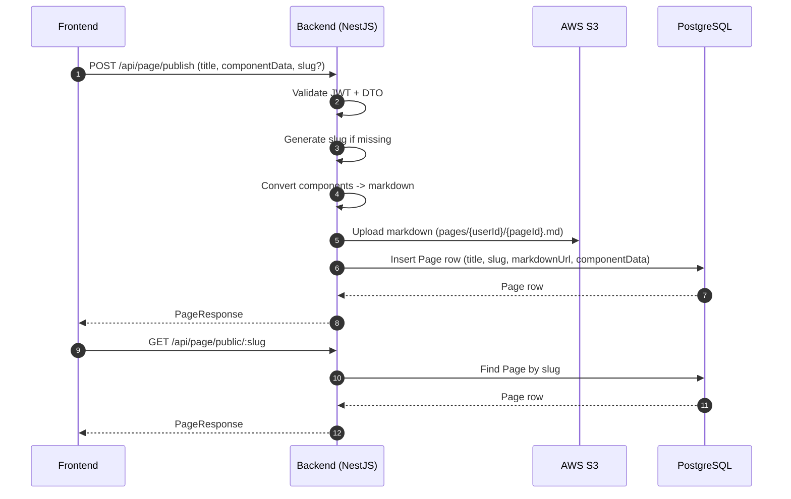

# Staged Changes Explained (Frontend Engineer View)

This doc summarizes the **staged** changes and explains what they mean in
frontend-friendly terms. It assumes no backend knowledge.

## Big Picture
You can now **publish** a built invitation to a **public URL** and render that
published page in a read-only view. The backend stores the invitation data,
creates a markdown snapshot, uploads it to S3, and serves it by `slug`.

## Backend logic at a glance (Mermaid)


---

## Frontend changes (what you will touch)

### 1) New Page API client
**File:** `ui/src/services/pageService.ts`
- Adds a small client for the new Page API.
- Core methods:
  - `publishPage(data)` -> POST `/api/page/publish` (auth required)
  - `getMyPages()` -> GET `/api/page/my-pages` (auth required)
  - `updatePage(id, data)` -> PUT `/api/page/:id` (auth required)
  - `deletePage(id)` -> DELETE `/api/page/:id` (auth required)
  - `getPublicPage(slug)` -> GET `/api/page/public/:slug` (no auth)
- Uses existing auth token helpers. If a 401 happens, it clears the token and
  throws a user-friendly error.

### 2) Builder header now publishes
**File:** `ui/src/components/Builder/BuilderHeader.tsx`
- Title input is now controlled by the parent (`Builder.tsx`).
- Clicking **Publish**:
  - If not logged in, it opens the auth modal.
  - If there are no components, it shows a toast error.
  - Otherwise it calls `publishPage({ title, componentData })`.
- Shows a toast success/error message and a loading spinner while publishing.

### 3) Builder view owns the invitation title
**File:** `ui/src/views/Builder.tsx`
- Moves `invitationTitle` state to the parent and passes it to the header.
- This lets the header publish with the correct title.

### 4) New published page view
**File:** `ui/src/views/PublishedPage.tsx`
- New route screen for **public pages**.
- Fetches data with `getPublicPage(slug)` and renders the components in
  read-only mode (`ComponentPreviewReadonly`).
- Handles loading state and a "Page Not Found" error view.

### 5) New route
**File:** `ui/src/index.tsx`
- Adds `/page/:slug` -> `PublishedPage`.

---

## Backend changes (plain English)
The backend now supports saving invitations as **Page** records and publishing
those pages to a **public URL**.

### New endpoints (what frontend can call)
- **POST** `/api/page/publish` (auth required)
  - Body: `{ title, slug?, componentData }`
  - Creates a new published page.
- **GET** `/api/page/public/:slug` (no auth)
  - Returns the published page data by slug.
- **GET** `/api/page/my-pages` (auth required)
  - Returns all pages for the logged-in user.
- **GET** `/api/page/:id` (auth required)
  - Returns a single page by id.
- **PUT** `/api/page/:id` (auth required)
  - Updates a page and bumps the version.
- **DELETE** `/api/page/:id` (auth required)
  - Deletes a page and its markdown file in S3.

### What happens when you publish
1) Backend generates a **slug** (if you didn't send one). It's based on the title
   plus a short id suffix to keep it unique.
2) It converts the builder components into **markdown** (front-matter + YAML
   blocks per component).
3) It uploads that markdown to **S3**.
4) It stores the page metadata + component data in the database.
5) It returns a `Page` object to the frontend.

### Data shape returned to frontend
This is the key response shape the frontend sees (simplified):

```ts
interface PageResponse {
  id: string;
  userId: string;
  title: string;
  slug: string;
  markdownPath: string;
  markdownUrl: string;
  componentData: { components: BuilderComponent[] };
  isPublished: boolean;
  version: number;
  createdAt: string;
  updatedAt: string;
  publishedAt?: string;
}
```

### New backend pieces (for awareness)
- `Page` entity stores title/slug/componentData + markdown path/URL.
- `PageService` handles publishing, updating, and deleting.
- `MarkdownConverterService` converts component data to markdown.
- S3 service now has `uploadText(...)` for markdown.

---

## Behavior you will notice in the UI
- Publish button now has a loading state.
- Publishing shows a toast with success/fail feedback.
- You can visit `http://<frontend-host>/page/:slug` to see the published page.

---

## Important backend config change (env)
The S3 service now expects **`AWS_S3_BUCKET`** (not `S3_BUCKET_NAME`).
If that env var is missing, the backend throws an error on startup.

---

## Quick sanity test (frontend only)
1) Start backend + frontend.
2) Build a sample invitation in the builder.
3) Click **Publish** (make sure you are logged in).
4) Use the returned page `slug` from the API response to open `/page/:slug`.
