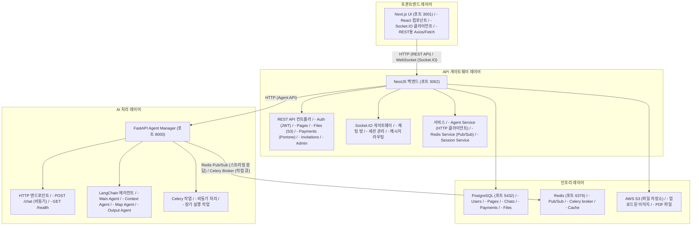
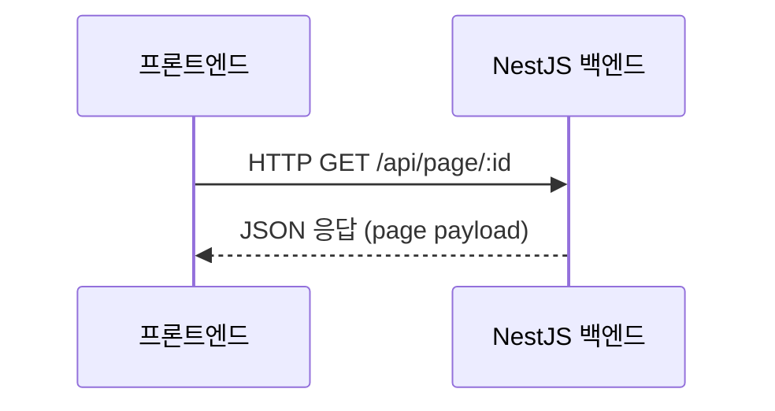
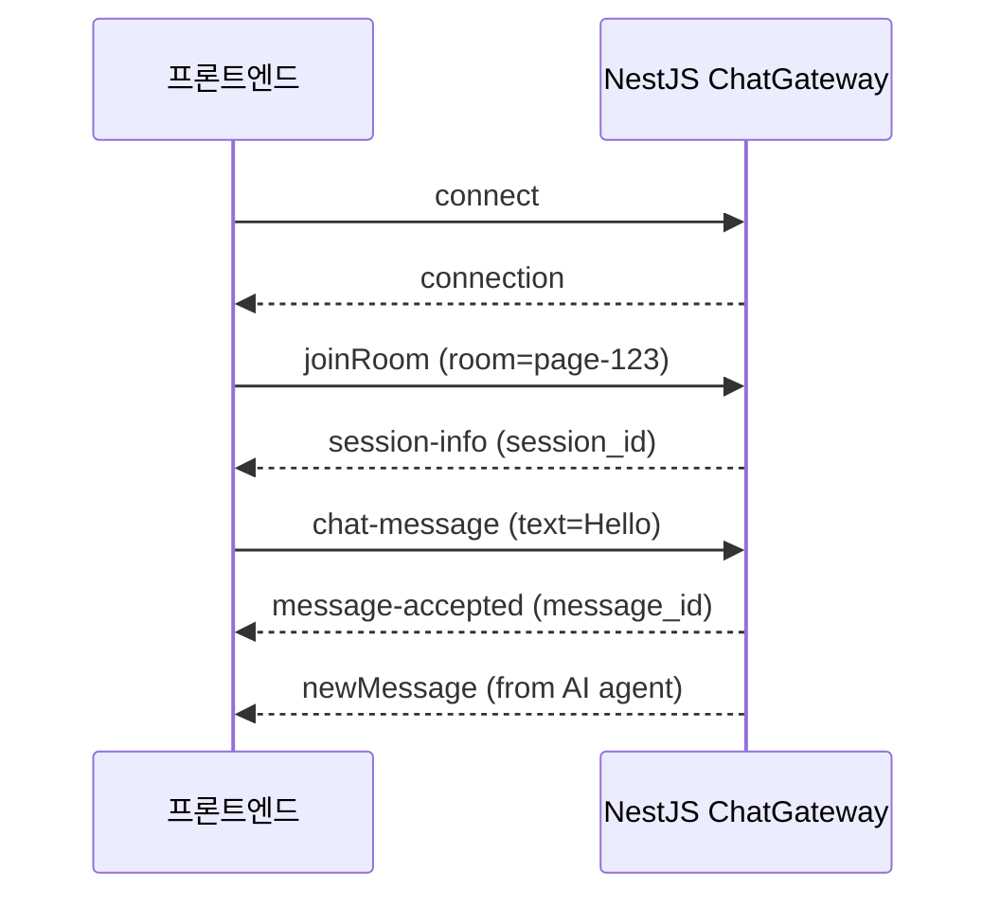
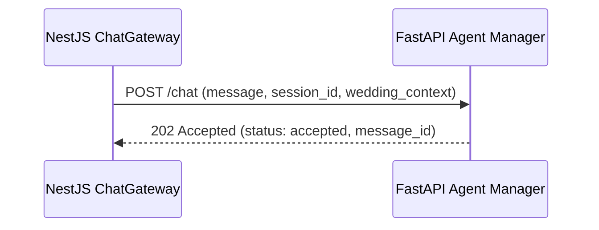
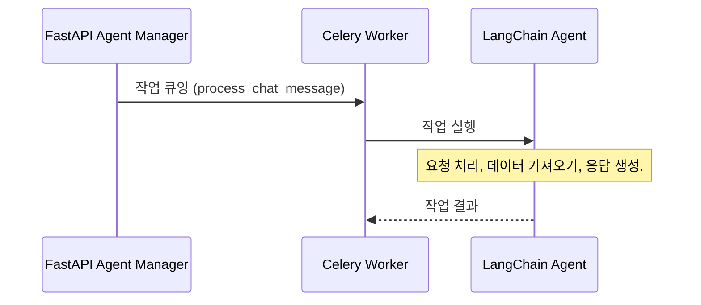
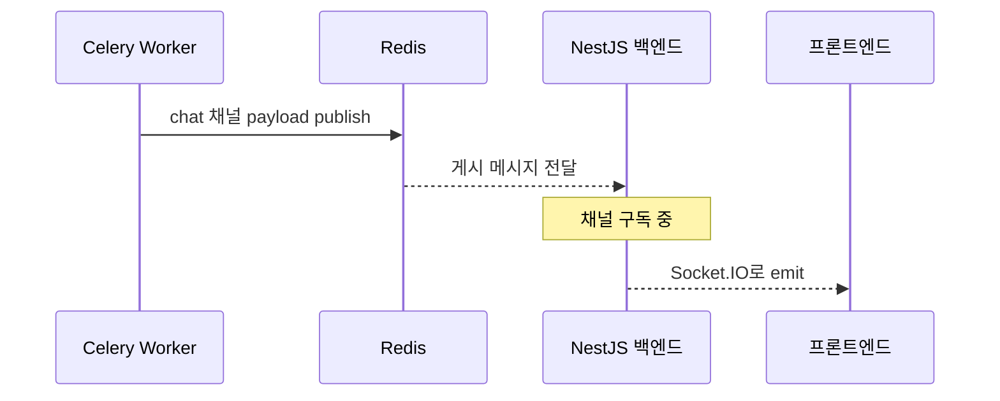
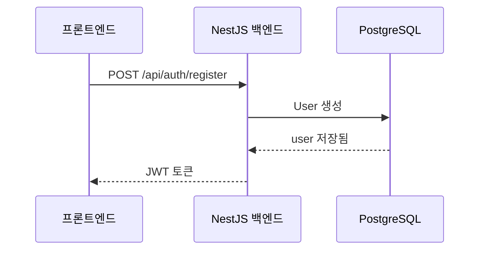
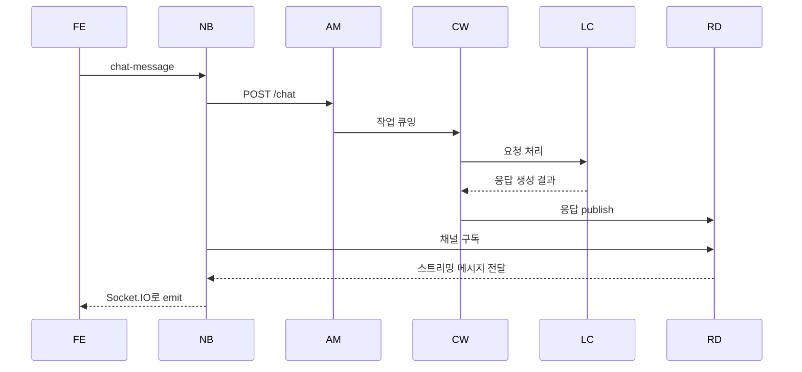
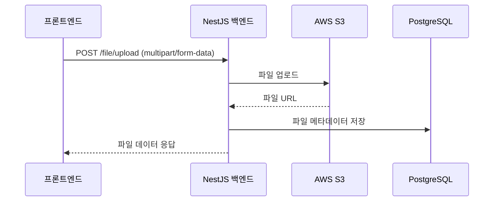

# 아키텍처 개요

이 문서는 모청 백엔드 아키텍처에 대한 포괄적인 개요를 제공하며, 서비스가 어떻게 통신하는지와 시스템을 통해 데이터가 어떻게 흐르는지에 중점을 둡니다.

## 목차

1. [시스템 아키텍처](#시스템-아키텍처)
2. [서비스 개요](#서비스-개요)
3. [서비스 통신](#서비스-통신)
4. [기술 스택](#기술-스택)
5. [데이터 흐름 패턴](#데이터-흐름-패턴)

## 시스템 아키텍처

모청은 두 개의 주요 백엔드 서비스가 있는 **마이크로서비스 아키텍처**를 사용합니다:



## 서비스 개요

### 1. Next.js UI (포트 3001)
- **목적**: 프론트엔드 애플리케이션
- **기술**: Next.js, React, Socket.IO Client
- **책임**:
  - 사용자 인터페이스 렌더링
  - API 클라이언트 (Axios/fetch)
  - WebSocket 클라이언트 (Socket.IO)
  - 상태 관리

### 2. NestJS 백엔드 (포트 3002)
- **목적**: 메인 API 서버 및 WebSocket 게이트웨이
- **기술**: NestJS (TypeScript), TypeORM, Socket.IO
- **책임**:
  - REST API 엔드포인트
  - WebSocket 연결
  - JWT 인증
  - 데이터베이스 작업 (PostgreSQL)
  - 파일 업로드 (S3)
  - Agent Manager와의 통합

### 3. FastAPI Agent Manager (포트 8000)
- **목적**: AI 에이전트 처리 서버
- **기술**: FastAPI (Python), LangChain, Celery
- **책임**:
  - 채팅 메시지 수신
  - Celery 작업 큐잉
  - Redis pub/sub을 통한 AI 응답 스트리밍
  - 헬스 모니터링

### 4. Celery Worker
- **목적**: 백그라운드 작업 처리
- **기술**: Celery (Python)
- **책임**:
  - LangChain 에이전트 작업 처리
  - 외부 API에서 데이터 가져오기
  - AI 응답 생성
  - Redis에 응답 게시

### 5. PostgreSQL (포트 5432)
- **목적**: 기본 데이터베이스
- **기술**: PostgreSQL 15
- **데이터**:
  - Users (인증)
  - Pages (웨딩 청첩장)
  - Chats (메시지 기록)
  - Payments (거래)
  - Files (메타데이터)
  - Invitations

### 6. Redis (포트 6379)
- **목적**: 캐시 및 메시지 브로커
- **기술**: Redis 7
- **용도**:
  - **Pub/Sub**: 실시간 메시지 분배
  - **Celery Broker**: 백그라운드 작업을 위한 작업 큐
  - **캐시**: 세션 데이터와 자주 액세스하는 데이터

### 7. AWS S3
- **목적**: 파일 저장소
- **용도**:
  - 사용자 업로드 이미지
  - PDF 파일
  - 정적 자산

## 서비스 통신

### 프론트엔드 → NestJS 백엔드

#### REST API 통신


**예시**:
```typescript
// 프론트엔드
const response = await axios.get('http://localhost:3002/api/page/123', {
  headers: { Authorization: `Bearer ${token}` }
});
```

#### WebSocket 통신 (Socket.IO)


**예시**:
```typescript
// 프론트엔드
const socket = io('http://localhost:3002/chat', {
  auth: { token: yourJwtToken }
});

socket.on('connect', () => {
  socket.emit('joinRoom', { room: 'page-123', userId: 'user-123' });
});

socket.on('newMessage', (message) => {
  console.log('새 메시지:', message);
});
```

### NestJS 백엔드 → Agent Manager

#### HTTP 통신


**핵심 포인트**: Agent Manager는 "accepted" 상태로 **즉시** 응답합니다. 처리는 Celery를 통해 비동기적으로 수행됩니다.

### Agent Manager → Celery Worker

#### 작업 큐 통신


### Celery Worker → NestJS 백엔드 (Redis 경유)

#### Redis Pub/Sub 통신


## 기술 스택

### NestJS 백엔드

| 레이어 | 기술 | 목적 |
|-------|-----------|---------|
| **프레임워크** | NestJS 11.x | 구조화된 TypeScript 프레임워크 |
| **ORM** | TypeORM 0.3.x | 데이터베이스 추상화 |
| **데이터베이스** | PostgreSQL 15 | 데이터 영구 저장 |
| **WebSocket** | Socket.IO 4.x | 실시간 통신 |
| **인증** | Passport + JWT | 인증 |
| **검증** | class-validator | 입력 검증 |
| **로깅** | Winston 3.x | 구조화된 로깅 |
| **저장소** | AWS SDK S3 | 파일 저장 |

### Agent Manager

| 레이어 | 기술 | 목적 |
|-------|-----------|---------|
| **프레임워크** | FastAPI 0.123.x | 현대적 Python 웹 프레임워크 |
| **AI/ML** | LangChain 1.1.x | AI 에이전트 오케스트레이션 |
| **작업 큐** | Celery 5.3.x | 백그라운드 처리 |
| **메시지 브로커** | Redis 5.x | Pub/Sub 및 작업 큐 |
| **검증** | Pydantic 2.x | 데이터 검증 |
| **HTTP 클라이언트** | httpx/requests | 외부 API 호출 |

## 데이터 흐름 패턴

### 1. 사용자 등록 플로우


### 2. 채팅 메시지 플로우 (완전)

약어: `FE` = 프론트엔드, `NB` = NestJS 백엔드, `AM` = Agent Manager, `CW` = Celery Worker, `LC` = LangChain, `RD` = Redis.

### 3. 파일 업로드 플로우


## 주요 아키텍처 결정

### 왜 두 개의 백엔드인가요?

1. **관심사 분리**:
   - NestJS는 비즈니스 로직, 인증, 데이터 관리 처리
   - Python 서비스는 AI/ML 처리 전문

2. **독립적 확장**:
   - API 트래픽을 위해 NestJS 확장
   - AI 처리를 위해 Python 서비스 확장

3. **기술 적합성**:
   - TypeScript/Node.js는 I/O 바운드 API 작업에 탁월
   - Python은 LangChain으로 AI/ML에 우수

4. **비동기 처리**:
   - Celery는 장기 실행 AI 작업을 차단 없이 처리
   - Redis pub/sub는 스트리밍 응답 가능

### 왜 Socket.IO인가요?

- **실시간 양방향 통신**
- **자동 재연결**
- **방 기반 메시징** (채팅 세션용)
- **브라우저 호환성**

### 왜 PostgreSQL인가요?

- **ACID 준수** (결제에 중요)
- **관계형 데이터** (사용자, 페이지, 채팅이 관련됨)
- **강력한 일관성**
- **풍부한 생태계**

### 왜 Redis인가요?

- **실시간 메시징을 위한 빠른 pub/sub**
- **작업 큐용 Celery broker**
- **성능을 위한 인메모리 캐시**

## 다음 단계

- [02-nestjs-backend-ko.md](./02-nestjs-backend-ko.md) - NestJS 백엔드 심층 분석
- [03-agent-manager-ko.md](./03-agent-manager-ko.md) - AI 에이전트 시스템 학습
- [04-api-integration-ko.md](./04-api-integration-ko.md) - 백엔드와 통합하는 방법
- [05-data-flow-ko.md](./05-data-flow-ko.md) - 상세한 데이터 흐름 예시
