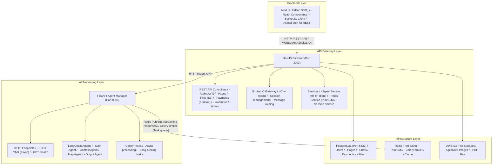
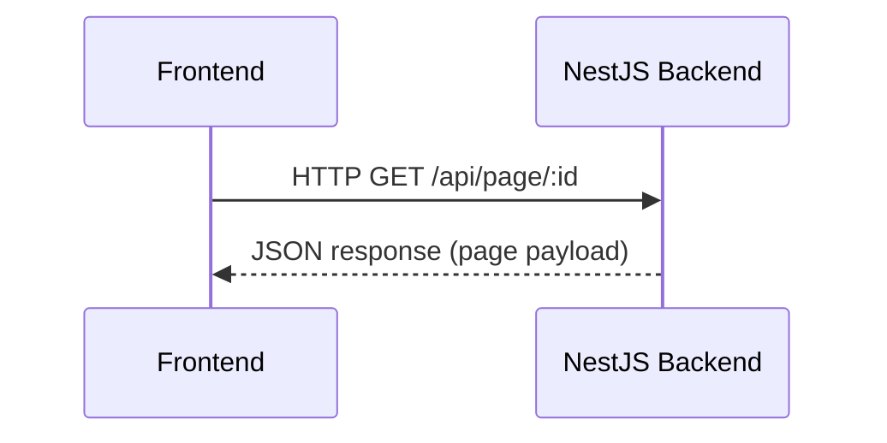
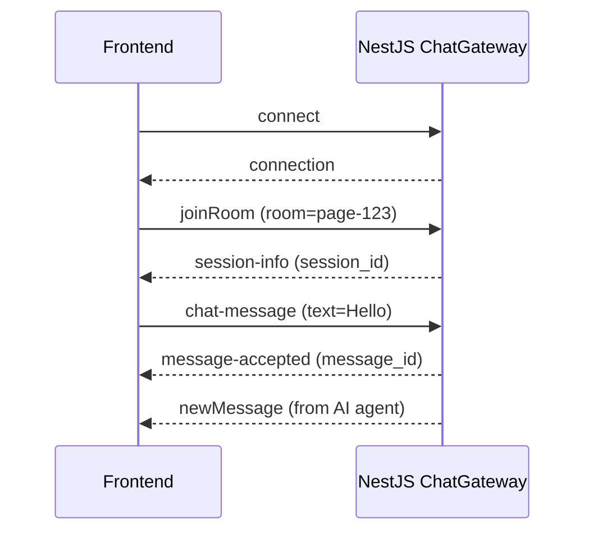
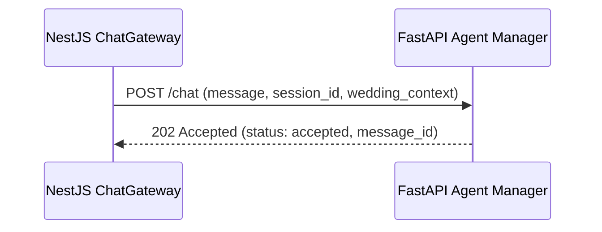
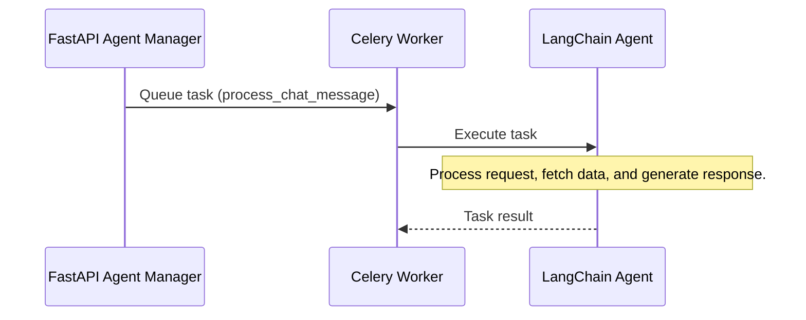
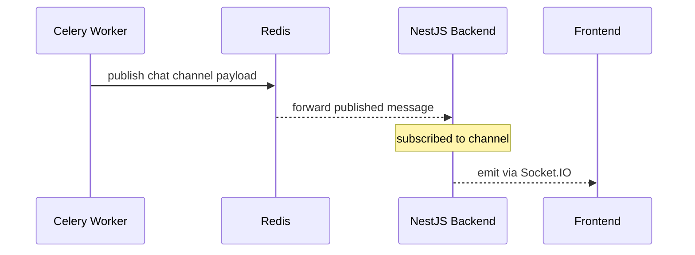
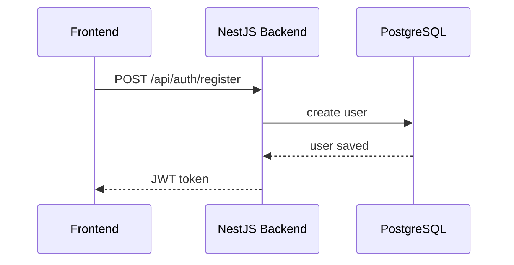
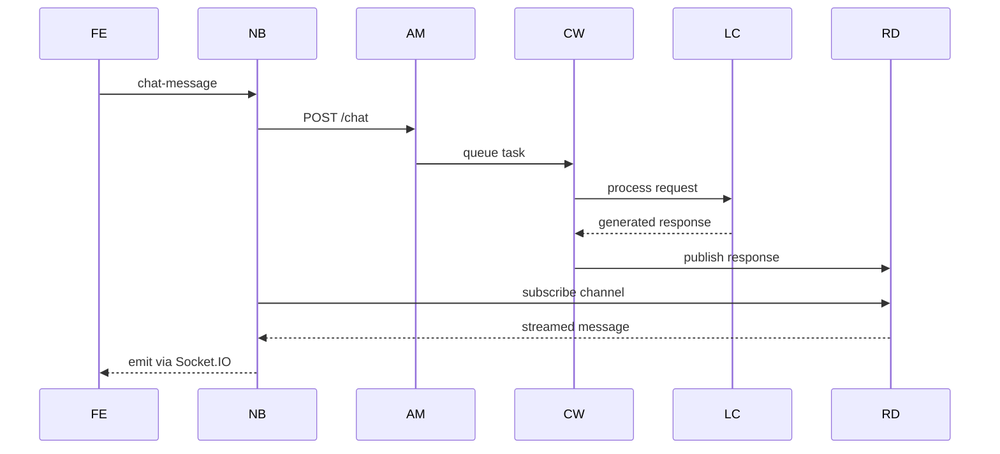
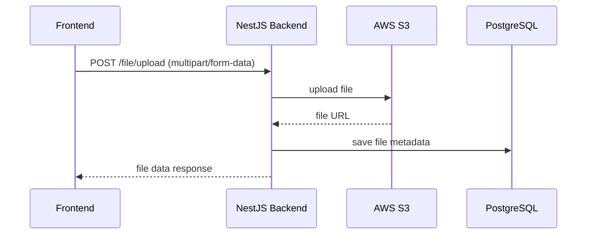

# Architecture Overview

This document provides a comprehensive overview of the Mocheong backend architecture, focusing on how services communicate and how data flows through the system.

## Table of Contents

1. [System Architecture](#system-architecture)
2. [Services Overview](#services-overview)
3. [Service Communication](#service-communication)
4. [Technology Stack](#technology-stack)
5. [Data Flow Patterns](#data-flow-patterns)

## System Architecture

Mocheong uses a **microservices architecture** with two main backend services:



## Services Overview

### 1. Next.js UI (Port 3001)
- **Purpose**: Frontend application
- **Technology**: Next.js, React, Socket.IO Client
- **Responsibilities**:
  - User interface rendering
  - API client (Axios/fetch)
  - WebSocket client (Socket.IO)
  - State management

### 2. NestJS Backend (Port 3002)
- **Purpose**: Main API server and WebSocket gateway
- **Technology**: NestJS (TypeScript), TypeORM, Socket.IO
- **Responsibilities**:
  - REST API endpoints
  - WebSocket connections
  - JWT authentication
  - Database operations (PostgreSQL)
  - File uploads (S3)
  - Integration with Agent Manager

### 3. FastAPI Agent Manager (Port 8000)
- **Purpose**: AI agent processing server
- **Technology**: FastAPI (Python), LangChain, Celery
- **Responsibilities**:
  - Accept chat messages
  - Queue Celery tasks
  - Stream AI responses via Redis pub/sub
  - Health monitoring

### 4. Celery Worker
- **Purpose**: Background task processing
- **Technology**: Celery (Python)
- **Responsibilities**:
  - Process LangChain agent tasks
  - Fetch data from external APIs
  - Generate AI responses
  - Publish responses to Redis

### 5. PostgreSQL (Port 5432)
- **Purpose**: Primary database
- **Technology**: PostgreSQL 15
- **Data**:
  - Users (authentication)
  - Pages (wedding invitations)
  - Chats (message history)
  - Payments (transactions)
  - Files (metadata)
  - Invitations

### 6. Redis (Port 6379)
- **Purpose**: Cache and message broker
- **Technology**: Redis 7
- **Uses**:
  - **Pub/Sub**: Real-time message distribution
  - **Celery Broker**: Task queue for background jobs
  - **Cache**: Session data and frequently accessed data

### 7. AWS S3
- **Purpose**: File storage
- **Uses**:
  - User uploaded images
  - PDF files
  - Static assets

## Service Communication

### Frontend → NestJS Backend

#### REST API Communication


**Example**:
```typescript
// Frontend
const response = await axios.get('http://localhost:3002/api/page/123', {
  headers: { Authorization: `Bearer ${token}` }
});
```

#### WebSocket Communication (Socket.IO)


**Example**:
```typescript
// Frontend
const socket = io('http://localhost:3002/chat', {
  auth: { token: yourJwtToken }
});

socket.on('connect', () => {
  socket.emit('joinRoom', { room: 'page-123', userId: 'user-123' });
});

socket.on('newMessage', (message) => {
  console.log('New message:', message);
});
```

### NestJS Backend → Agent Manager

#### HTTP Communication


**Key Point**: The Agent Manager returns **immediately** with "accepted" status. Processing happens asynchronously via Celery.

### Agent Manager → Celery Worker

#### Task Queue Communication


### Celery Worker → NestJS Backend (via Redis)

#### Redis Pub/Sub Communication


## Technology Stack

### NestJS Backend

| Layer | Technology | Purpose |
|-------|-----------|---------|
| **Framework** | NestJS 11.x | Structured TypeScript framework |
| **ORM** | TypeORM 0.3.x | Database abstraction |
| **Database** | PostgreSQL 15 | Data persistence |
| **WebSocket** | Socket.IO 4.x | Real-time communication |
| **Auth** | Passport + JWT | Authentication |
| **Validation** | class-validator | Input validation |
| **Logging** | Winston 3.x | Structured logging |
| **Storage** | AWS SDK S3 | File storage |

### Agent Manager

| Layer | Technology | Purpose |
|-------|-----------|---------|
| **Framework** | FastAPI 0.123.x | Modern Python web framework |
| **AI/ML** | LangChain 1.1.x | AI agent orchestration |
| **Task Queue** | Celery 5.3.x | Background processing |
| **Message Broker** | Redis 5.x | Pub/Sub & task queue |
| **Validation** | Pydantic 2.x | Data validation |
| **HTTP Client** | httpx/requests | External API calls |

## Data Flow Patterns

### 1. User Registration Flow


### 2. Chat Message Flow (Complete)

Abbreviations: `FE` = Frontend, `NB` = NestJS Backend, `AM` = Agent Manager, `CW` = Celery Worker, `LC` = LangChain, `RD` = Redis.

### 3. File Upload Flow


## Key Architectural Decisions

### Why Two Backends?

1. **Separation of Concerns**:
   - NestJS handles business logic, authentication, and data management
   - Python service specializes in AI/ML processing

2. **Independent Scaling**:
   - Scale NestJS for API traffic
   - Scale Python service for AI processing

3. **Technology Fit**:
   - TypeScript/Node.js is excellent for I/O-bound API operations
   - Python is superior for AI/ML with LangChain

4. **Async Processing**:
   - Celery allows long-running AI tasks without blocking
   - Redis pub/sub enables streaming responses

### Why Socket.IO?

- **Real-time bidirectional communication**
- **Automatic reconnection**
- **Room-based messaging** (for chat sessions)
- **Browser compatibility**

### Why PostgreSQL?

- **ACID compliance** (critical for payments)
- **Relational data** (users, pages, chats are related)
- **Strong consistency**
- **Rich ecosystem**

### Why Redis?

- **Fast pub/sub** for real-time messaging
- **Celery broker** for task queue
- **In-memory caching** for performance

## Next Steps

- [02-nestjs-backend.md](./02-nestjs-backend.md) - Deep dive into NestJS backend
- [03-agent-manager.md](./03-agent-manager.md) - Learn about the AI agent system
- [04-api-integration.md](./04-api-integration.md) - How to integrate with the backend
- [05-data-flow.md](./05-data-flow.md) - Detailed data flow examples
