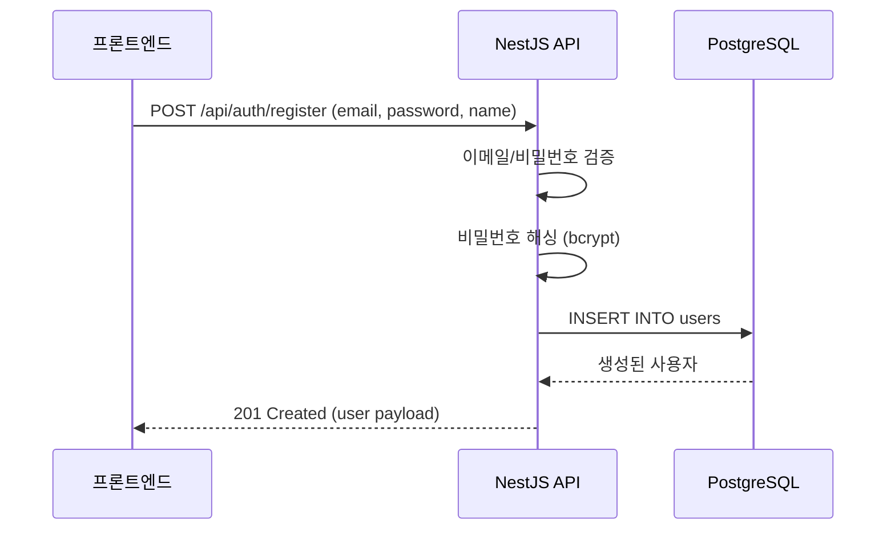
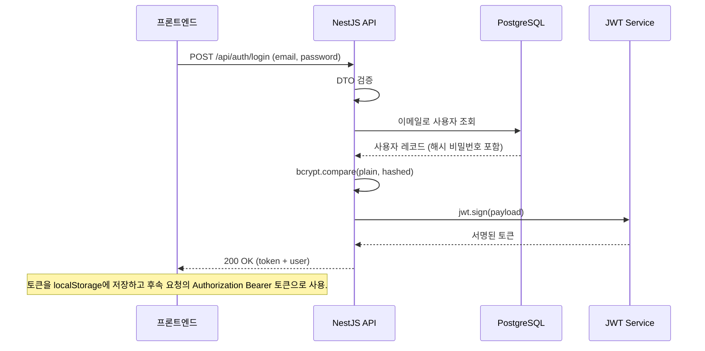
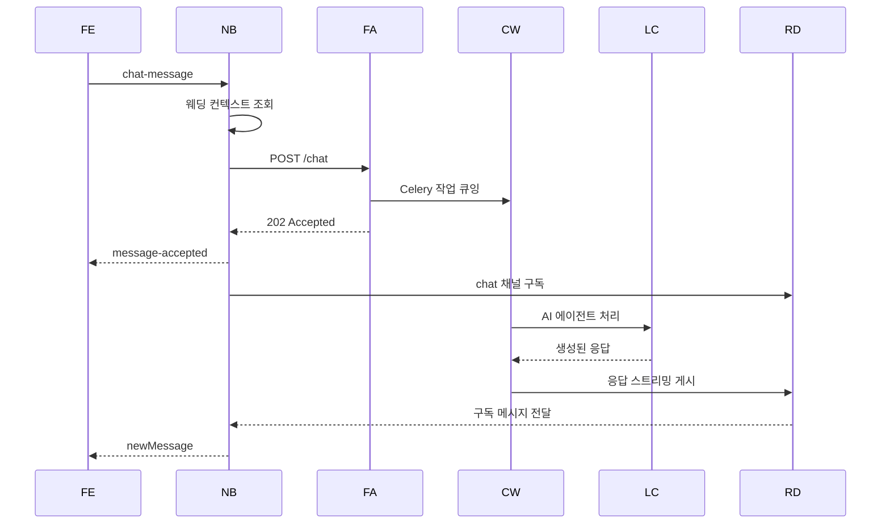
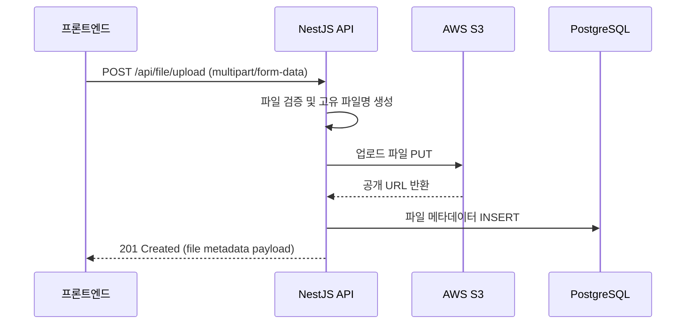
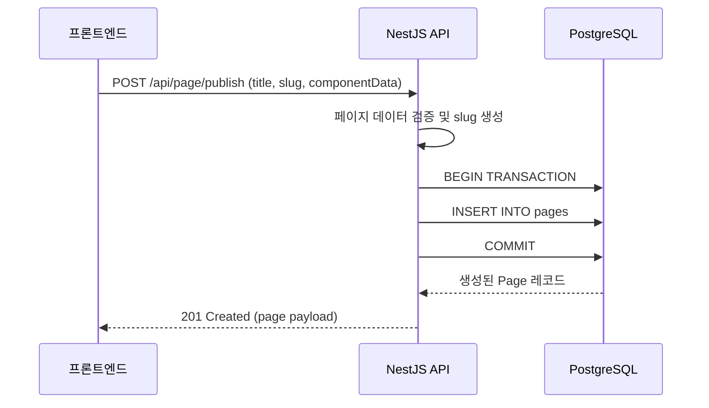

# 데이터 흐름 가이드

이 가이드는 일반적인 작업에 대해 데이터가 모청 시스템을 통해 어떻게 흐르는지에 대한 상세한 설명을 제공합니다.

## 목차

1. [사용자 등록 플로우](#사용자-등록-플로우)
2. [로그인 및 인증 플로우](#로그인-및-인증-플로우)
3. [채팅 메시지 플로우 (완전)](#채팅-메시지-플로우-완전)
4. [파일 업로드 플로우](#파일-업로드-플로우)
5. [페이지 게시 플로우](#페이지-게시-플로우)

## 사용자 등록 플로우

### 단계별 설명

1. **프론트엔드**: 사용자가 등록 폼 작성
2. **프론트엔드**: `{ email, password, name }`으로 `POST /api/auth/register` 전송
3. **NestJS**: 이메일 형식과 비밀번호 강도 검증
4. **NestJS**: bcrypt로 비밀번호 해싱 (10 라운드)
5. **PostgreSQL**: 해시된 비밀번호로 User 레코드 생성
6. **NestJS**: User 객체 반환 (비밀번호 제외)
7. **프론트엔드**: 성공 메시지 표시 또는 로그인으로 리디렉션

## 로그인 및 인증 플로우

### 단계별 설명

1. **프론트엔드**: 사용자가 이메일과 비밀번호 입력
2. **프론트엔드**: `{ email, password }`로 `POST /api/auth/login` 전송
3. **NestJS**: 요청 DTO 검증
4. **NestJS**: 이메일로 PostgreSQL에서 사용자 조회
5. **PostgreSQL**: 사용자 레코드 반환 (해시된 비밀번호 포함)
6. **NestJS**: bcrypt로 제공된 비밀번호와 해시 비교
7. **NestJS JWT Service**: 페이로드 `{ email, sub: id }`로 JWT 토큰 생성
8. **NestJS**: `{ access_token, user }` 반환
9. **프론트엔드**: 토큰을 localStorage에 저장
10. **프론트엔드**: 모든 후속 요청에 `Authorization: Bearer {token}` 헤더에 토큰 포함

## 채팅 메시지 플로우 (완전)

가장 복잡한 플로우로, Socket.IO, HTTP, Redis, Celery, LangChain 에이전트가 포함됩니다.

약어: `FE` = 프론트엔드, `NB` = NestJS 백엔드, `FA` = FastAPI Agent Manager, `CW` = Celery Worker, `LC` = LangChain, `RD` = Redis.

### 상세 단계

1. **프론트엔드**: 사용자가 "결혼식이 언제인가요?" 입력
2. **프론트엔드 → NestJS**: 텍스트, 세션 정보로 Socket.IO emit `chat-message`
3. **NestJS**: 메시지 수신, `session_id` 및 `wedding_id` 추출
4. **NestJS → PostgreSQL**: 웨딩 페이지 컨텍스트 가져오기 (이름, 날짜, 장소 등)
5. **NestJS → FastAPI**: 메시지, session_id, wedding_context으로 HTTP POST `/chat`
6. **FastAPI**: Celery 작업 큐 `process_chat_message.delay(request_data)`
7. **FastAPI → NestJS**: `message_id`와 함께 202 Accepted 반환
8. **NestJS → 프론트엔드**: Socket.IO을 통해 `message-accepted` emit
9. **NestJS → Redis**: `chat:{session_id}` 채널 구독
10. **Celery Worker**: 큐에서 작업 수신
11. **Celery Worker → LangChain**: Main Agent로 메시지 처리
12. **Main Agent**: 호출할 하위 에이전트 결정 (Context, Map, Output)
13. **Context Agent**: 웨딩 정보 가져오기
14. **Main Agent**: 응답 생성
15. **Celery Worker → Redis**: `chat:{session_id}`에 응답 게시
16. **Redis → NestJS**: 구독자에게 메시지 전달
17. **NestJS → 프론트엔드**: Socket.IO을 통해 `newMessage` emit
18. **프론트엔드**: AI 응답 표시

## 파일 업로드 플로우

## 페이지 게시 플로우

## 다음 단계

- [03-agent-manager-ko.md](./03-agent-manager-ko.md) - AI 에이전트 처리 심층 분석
- [04-api-integration-ko.md](./04-api-integration-ko.md) - 통합을 위한 코드 예시
- [08-debugging-ko.md](./08-debugging-ko.md) - 데이터 흐름 문제 해결
