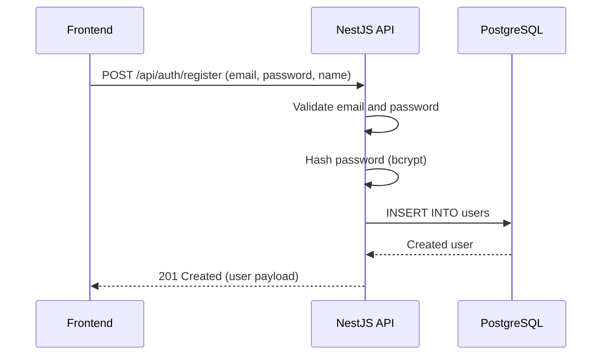
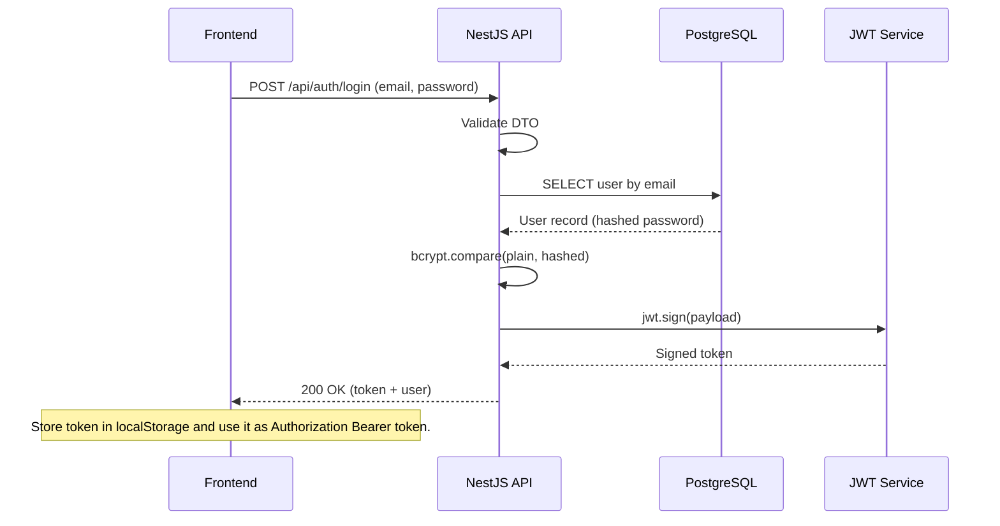
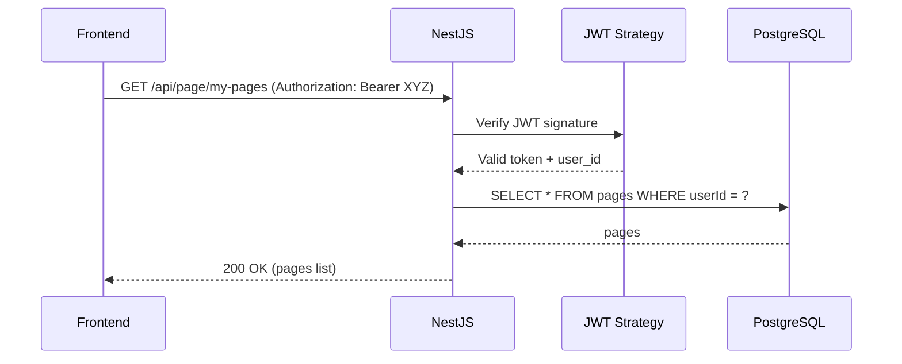
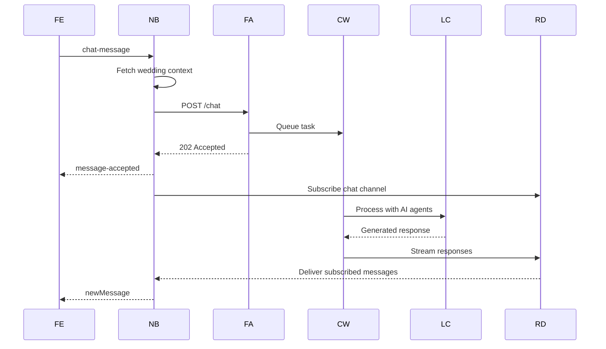
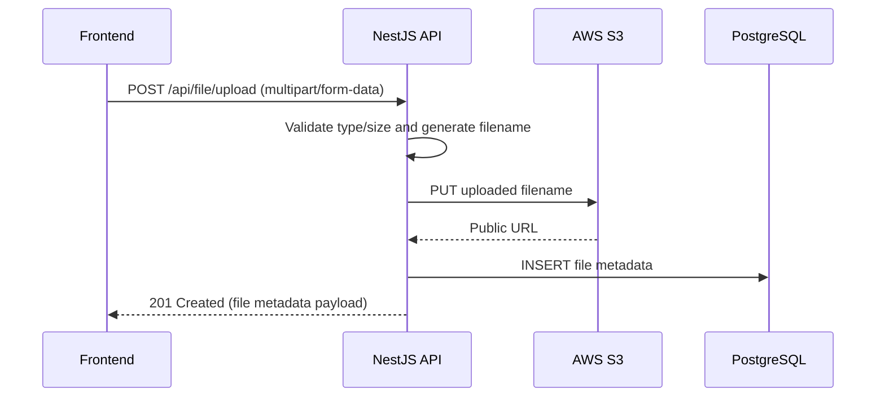
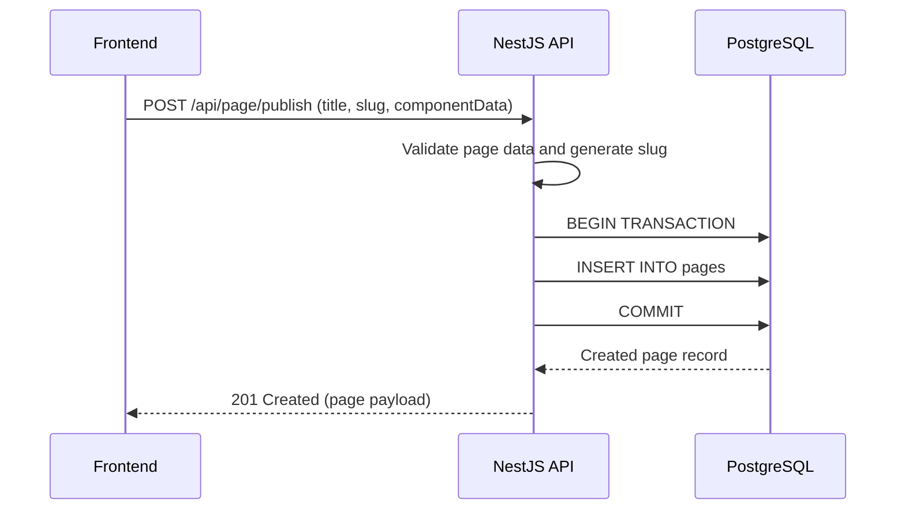

# Data Flow Guide

This guide provides detailed explanations of how data flows through the Mocheong system for common operations.

## Table of Contents

1. [User Registration Flow](#user-registration-flow)
2. [Login & Authentication Flow](#login--authentication-flow)
3. [Chat Message Flow (Complete)](#chat-message-flow-complete)
4. [File Upload Flow](#file-upload-flow)
5. [Page Publish Flow](#page-publish-flow)

## User Registration Flow



### Step-by-Step

1. **Frontend**: User fills registration form
2. **Frontend**: Send `POST /api/auth/register` with `{ email, password, name }`
3. **NestJS**: Validate email format and password strength
4. **NestJS**: Hash password using bcrypt (10 rounds)
5. **PostgreSQL**: Create User record with hashed password
6. **NestJS**: Return created User object (without password)
7. **Frontend**: Display success message or redirect to login

### Code Flow

**Frontend**:
```typescript
const register = async (email, password, name) => {
  const response = await axios.post('/api/auth/register', {
    email,
    password,
    name
  });
  // User created successfully
  return response.data;
};
```

**Backend** (`auth.service.ts`):
```typescript
async register(email, password, name) {
  // Check if user exists
  const existingUser = await this.userRepository.findByEmail(email);
  if (existingUser) throw new ConflictException('User already exists');

  // Hash password
  const hashedPassword = await bcrypt.hash(password, 10);

  // Create user
  const user = await this.userRepository.create({
    email,
    password: hashedPassword,
    name
  });

  return user;
}
```

## Login & Authentication Flow



### Step-by-Step

1. **Frontend**: User enters email and password
2. **Frontend**: Send `POST /api/auth/login` with `{ email, password }`
3. **NestJS**: Validate request DTO
4. **NestJS**: Query PostgreSQL for user by email
5. **PostgreSQL**: Return user record (with hashed password)
6. **NestJS**: Compare provided password with hash using bcrypt
7. **NestJS JWT Service**: Generate JWT token with payload `{ email, sub: id }`
8. **NestJS**: Return `{ access_token, user }`
9. **Frontend**: Store token in localStorage
10. **Frontend**: Include token in `Authorization: Bearer {token}` header for all subsequent requests

### Protected Request Flow



## Chat Message Flow (Complete)

This is the most complex flow, involving Socket.IO, HTTP, Redis, Celery, and LangChain agents.


Abbreviations: `FE` = Frontend, `NB` = NestJS Backend, `FA` = FastAPI Agent Manager, `CW` = Celery Worker, `LC` = LangChain, `RD` = Redis.

### Detailed Steps

1. **Frontend**: User types "When is the wedding?"
2. **Frontend → NestJS**: Socket.IO emit `chat-message` with text, session info
3. **NestJS**: Receive message, extract `session_id` and `wedding_id`
4. **NestJS → PostgreSQL**: Fetch wedding page context (names, date, venue, etc.)
5. **NestJS → FastAPI**: HTTP POST `/chat` with message, session_id, wedding_context
6. **FastAPI**: Queue Celery task `process_chat_message.delay(request_data)`
7. **FastAPI → NestJS**: Return 202 Accepted with `message_id`
8. **NestJS → Frontend**: Emit `message-accepted` via Socket.IO
9. **NestJS → Redis**: Subscribe to channel `chat:{session_id}`
10. **Celery Worker**: Pick up task from queue
11. **Celery Worker → LangChain**: Process message with Main Agent
12. **Main Agent**: Decide which sub-agents to call (Context, Map, Output)
13. **Context Agent**: Fetch wedding information
14. **Main Agent**: Generate response
15. **Celery Worker → Redis**: Publish response to `chat:{session_id}`
16. **Redis → NestJS**: Deliver message to subscriber
17. **NestJS → Frontend**: Emit `newMessage` via Socket.IO
18. **Frontend**: Display AI response

### Message Types

The AI agent can respond with different message types:

1. **Text Message**: `{ type: "text", content: "The wedding is on..." }`
2. **Component Message**: `{ type: "component", component: { type: "AgentSuggestMessage", props: {...} } }`
3. **Error**: `{ type: "error", error: "...", details: "..." }`

## File Upload Flow



### Step-by-Step

1. **Frontend**: User selects file from file picker
2. **Frontend**: Send `POST /api/file/upload` with multipart/form-data
3. **NestJS**: Receive file using Multer
4. **NestJS**: Validate file type (image/jpeg, image/png, application/pdf) and size (max 10MB)
5. **NestJS**: Generate unique filename
6. **NestJS → AWS S3**: Upload file to S3 bucket
7. **AWS S3**: Return public URL
8. **NestJS → PostgreSQL**: Save file metadata (filename, URL, userId, mimeType, size)
9. **NestJS**: Return file metadata to frontend

## Page Publish Flow



### Component Data Structure

```typescript
{
  components: [
    {
      type: "Cover",
      id: "cover-1",
      props: {
        title: "우리 결혼합니다",
        groomName: "김신랑",
        brideName: "이신부",
        date: "2025년 12월 27일",
        place: "상록아트홀",
        mainPhoto: "https://s3.../photo.jpg"
      }
    },
    {
      type: "Calendar",
      id: "calendar-1",
      props: {
        weddingDate: "2025-12-27",
        weddingDateText: "2025년 12월 27일 토요일 낮 1시"
      }
    },
    {
      type: "Location",
      id: "location-1",
      props: {
        placeName: "상록아트홀",
        address: "서울시...",
        mapUrl: "https://..."
      }
    }
  ]
}
```

## Next Steps

- [03-agent-manager.md](./03-agent-manager.md) - Deep dive into AI agent processing
- [04-api-integration.md](./04-api-integration.md) - Code examples for integration
- [08-debugging.md](./08-debugging.md) - Troubleshooting data flow issues
