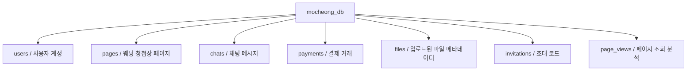
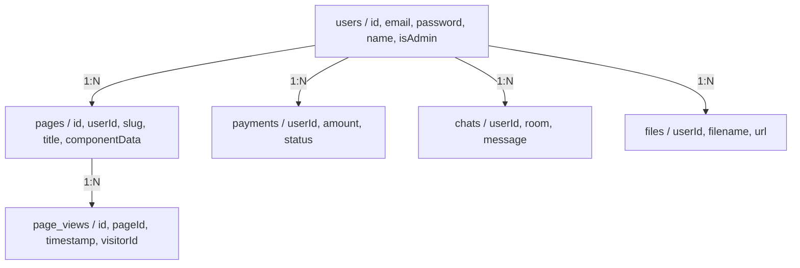

# 데이터베이스 및 데이터 모델 가이드

이 가이드는 모청 백엔드에서 사용되는 데이터베이스 구조와 데이터 모델을 설명합니다.

## 목차

1. [PostgreSQL 개요](#postgresql-개요)
2. [TypeORM 엔티티](#typeorm-엔티티)
3. [엔티티 관계](#엔티티-관계)
4. [리포지토리 패턴](#리포지토리-패턴)

## PostgreSQL 개요

### PostgreSQL이란?

**PostgreSQL**은 강력한 오픈 소스 관계형 데이터베이스 시스템입니다.

- **ACID 준수**: 신뢰할 수 있는 트랜잭션 보장
- **관계형**: 테이블과 관계로 데이터 정리
- **SQL**: 쿼리를 위한 표준 SQL 사용

### 데이터베이스 스키마



## TypeORM 엔티티

### User 엔티티

**테이블**: `users`

```typescript
@Entity('users')
export class User {
  @PrimaryGeneratedColumn('uuid')
  id: string;                    // 기본 키

  @Column({ unique: true })
  email: string;                 // 사용자 이메일 (고유)

  @Column()
  password: string;              // 해시된 비밀번호 (bcrypt)

  @Column({ nullable: true })
  name?: string;                 // 표시 이름

  @Column({ default: false })
  isAdmin: boolean;              // 관리자 권한

  @Column({ default: true })
  isActive: boolean;             // 계정 상태

  @CreateDateColumn()
  createdAt: Date;               // 계정 생성 타임스탬프

  @UpdateDateColumn()
  updatedAt: Date;               // 마지막 업데이트 타임스탬프
}
```

**관계**:
- Has many `pages`
- Has many `chats`
- Has many `payments`
- Has many `files`
- Has many `invitations`

### Page 엔티티

**테이블**: `pages`

```typescript
@Entity('pages')
export class Page {
  @PrimaryGeneratedColumn('uuid')
  id: string;

  @Column()
  slug: string;                  // URL 슬러그 (예: "wedding-123")

  @Column()
  title: string;                 // 페이지 제목

  @Column({ type: 'json' })
  componentData: any;            // 컴포넌트 트리 구조

  @Column({ default: false })
  isPublished: boolean;          // 게시 상태

  @Column()
  userId: string;                // 소유자 사용자 ID

  @ManyToOne(() => User)
  @JoinColumn({ name: 'userId' })
  user: User;                    // 소유자 관계

  @CreateDateColumn()
  createdAt: Date;

  @UpdateDateColumn()
  updatedAt: Date;

  @OneToMany(() => PageView, (view) => view.page)
  views: PageView[];             // 조회 분석
}
```

## 엔티티 관계



## 리포지토리 패턴

### 기본 리포지토리

```typescript
export class BaseRepository<T> {
  constructor(protected repository: Repository<T>) {}

  async create(data: DeepPartial<T>): Promise<T> {
    return this.repository.save(data);
  }

  async findById(id: string): Promise<T | null> {
    return this.repository.findOne({ where: { id } as any });
  }

  async findAll(): Promise<T[]> {
    return this.repository.find();
  }

  async update(id: string, data: DeepPartial<T>): Promise<T | null> {
    await this.repository.update(id, data);
    return this.findById(id);
  }

  async delete(id: string): Promise<boolean> {
    const result = await this.repository.delete(id);
    return result.affected > 0;
  }
}
```

### 사용 예시

```typescript
// 리포지토리를 사용하는 서비스
@Injectable()
export class PageService {
  constructor(
    @InjectRepository(Page)
    private pageRepository: Repository<Page>
  ) {}

  async createPage(userId: string, data: CreatePageDto): Promise<Page> {
    const page = this.pageRepository.create({
      ...data,
      userId,
    });
    return this.pageRepository.save(page);
  }

  async findBySlug(slug: string): Promise<Page | null> {
    return this.pageRepository.findOne({
      where: { slug },
      relations: ['user'], // 관련된 사용자 포함
    });
  }
}
```

## 다음 단계

- [02-nestjs-backend-ko.md](./02-nestjs-backend-ko.md) - REST 엔드포인트 학습
- [05-data-flow-ko.md](./05-data-flow-ko.md) - 데이터베이스를 통한 데이터 흐름 이해
