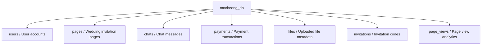
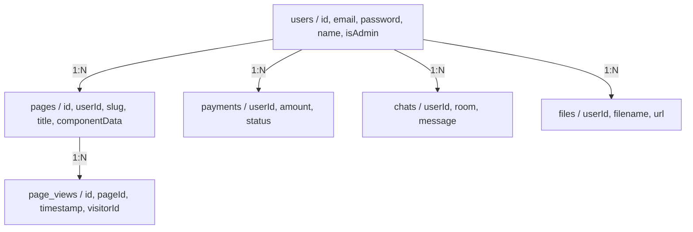

# Database & Data Models Guide

This guide explains the database structure and data models used in the Mocheong backend.

## Table of Contents

1. [PostgreSQL Overview](#postgresql-overview)
2. [TypeORM Entities](#typeorm-entities)
3. [Entity Relationships](#entity-relationships)
4. [Repository Pattern](#repository-pattern)

## PostgreSQL Overview

### What is PostgreSQL?

**PostgreSQL** is a powerful, open-source relational database system.

- **ACID compliant**: Guarantees reliable transactions
- **Relational**: Data is organized into tables with relationships
- **SQL**: Uses standard SQL for queries

### Database Schema



## TypeORM Entities

### User Entity

**Table**: `users`

```typescript
@Entity('users')
export class User {
  @PrimaryGeneratedColumn('uuid')
  id: string;                    // Primary key

  @Column({ unique: true })
  email: string;                 // User email (unique)

  @Column()
  password: string;              // Hashed password (bcrypt)

  @Column({ nullable: true })
  name?: string;                 // Display name

  @Column({ default: false })
  isAdmin: boolean;              // Admin privileges

  @Column({ default: true })
  isActive: boolean;             // Account status

  @CreateDateColumn()
  createdAt: Date;               // Account creation timestamp

  @UpdateDateColumn()
  updatedAt: Date;               // Last update timestamp
}
```

**Relationships**:
- Has many `pages`
- Has many `chats`
- Has many `payments`
- Has many `files`
- Has many `invitations`

### Page Entity

**Table**: `pages`

```typescript
@Entity('pages')
export class Page {
  @PrimaryGeneratedColumn('uuid')
  id: string;

  @Column()
  slug: string;                  // URL slug (e.g., "wedding-123")

  @Column()
  title: string;                 // Page title

  @Column({ type: 'json' })
  componentData: any;            // Component tree structure

  @Column({ default: false })
  isPublished: boolean;          // Publication status

  @Column()
  userId: string;                // Owner user ID

  @ManyToOne(() => User)
  @JoinColumn({ name: 'userId' })
  user: User;                    // Owner relation

  @CreateDateColumn()
  createdAt: Date;

  @UpdateDateColumn()
  updatedAt: Date;

  @OneToMany(() => PageView, (view) => view.page)
  views: PageView[];             // View analytics
}
```

### Chat Entity

**Table**: `chats`

```typescript
@Entity('chats')
export class Chat {
  @PrimaryGeneratedColumn('uuid')
  id: string;

  @Column()
  room: string;                  // Chat room identifier

  @Column()
  userId: string;                // Sender ID

  @ManyToOne(() => User)
  @JoinColumn({ name: 'userId' })
  user: User;

  @Column('text')
  message: string;               // Message content

  @Column({ default: 'text' })
  type: string;                  // 'text' | 'image' | 'file'

  @Column({ type: 'json', nullable: true })
  metadata?: any;                // Additional data

  @CreateDateColumn()
  createdAt: Date;
}
```

## Entity Relationships



## Repository Pattern

### Base Repository

```typescript
export class BaseRepository<T> {
  constructor(protected repository: Repository<T>) {}

  async create(data: DeepPartial<T>): Promise<T> {
    return this.repository.save(data);
  }

  async findById(id: string): Promise<T | null> {
    return this.repository.findOne({ where: { id } as any });
  }

  async findAll(): Promise<T[]> {
    return this.repository.find();
  }

  async update(id: string, data: DeepPartial<T>): Promise<T | null> {
    await this.repository.update(id, data);
    return this.findById(id);
  }

  async delete(id: string): Promise<boolean> {
    const result = await this.repository.delete(id);
    return result.affected > 0;
  }
}
```

### Usage Example

```typescript
// Service using repository
@Injectable()
export class PageService {
  constructor(
    @InjectRepository(Page)
    private pageRepository: Repository<Page>
  ) {}

  async createPage(userId: string, data: CreatePageDto): Promise<Page> {
    const page = this.pageRepository.create({
      ...data,
      userId,
    });
    return this.pageRepository.save(page);
  }

  async findBySlug(slug: string): Promise<Page | null> {
    return this.pageRepository.findOne({
      where: { slug },
      relations: ['user'], // Include related user
    });
  }
}
```

## Next Steps

- [02-nestjs-backend.md](./02-nestjs-backend.md) - Learn about REST endpoints
- [05-data-flow.md](./05-data-flow.md) - Understand data flow through the database
