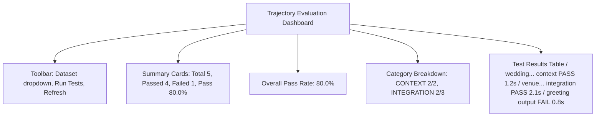

# Quick Start: Admin Evaluation Page

## 🚀 Installation

```bash
# 1. Install Python dependencies (if not already done)
cd agent_mgr
pip install -r requirements.txt

# 2. Start backend server
cd ../backend
npm run start:dev

# 3. Start frontend server (in new terminal)
cd ui
npm run dev
```

## 📍 Access the Page

1. Open browser: `http://localhost:3000`
2. Login with admin account
3. Navigate to **Admin → Evaluation** (in sidebar)

## 🎯 What You'll See



## 🎨 Color Guide

| Color | Meaning |
|-------|---------|
| 🟢 Green | Passing test / Fast execution |
| 🔵 Blue | Normal execution time |
| 🟡 Yellow | Slow execution / Warning |
| 🔴 Red | Failing test / Very slow / Critical issue |

## 📊 Test Scenarios

Currently available in `main_agent_scenarios`:

1. **wedding_info_query** (context)
   - Tests: Context agent information retrieval
   - Expected: PASS

2. **wedding_venue_location** (integration)
   - Tests: Context + Map integration
   - Expected: PASS

3. **wedding_directions** (integration)
   - Tests: Full agent orchestration
   - Expected: PASS

4. **simple_greeting** (output)
   - Tests: Output agent only
   - Expected: PASS

5. **complex_query** (integration)
   - Tests: Multi-tool coordination
   - Expected: MAY FAIL (needs improvement)

## 🛠️ Common Actions

### Run All Tests
Click **"Run Tests"** button → Wait ~30 seconds → View results

### Refresh Results
Click **↻** icon → Loads cached results instantly

### Switch Dataset
Use dropdown → Select different test suite → Auto-loads results

### View Details
Each row shows:
- Test name and description
- Category badge
- Pass/Fail status
- Execution time
- Individual evaluation checkmarks

## ⚠️ Troubleshooting

**"Failed to fetch" error**
→ Backend not running? Start: `cd backend && npm run start:dev`

**"Module not found" error**
→ Install dependencies: `cd agent_mgr && pip install -r requirements.txt`

**Tests all failing**
→ Check wedding-info.md exists in project root

**Page loading forever**
→ Check browser console (F12) for errors

## 📱 Tips

- Results are **cached** after first run (instant reload)
- Tests run in **background** - don't close tab
- **Execution time** badges help identify performance issues
- **Category breakdown** shows which areas need work
- Use **text format** for debugging: `python3 run_evaluation.py --format text`

## 🎯 Next Steps

1. ✅ Verify all tests pass
2. ✅ Check execution times are acceptable
3. ✅ Review agent responses for accuracy
4. ✅ Add more test scenarios as needed
5. ✅ Set up automated testing (optional)

---

Need more details? See `EVALUATION_PAGE_IMPLEMENTATION.md`
